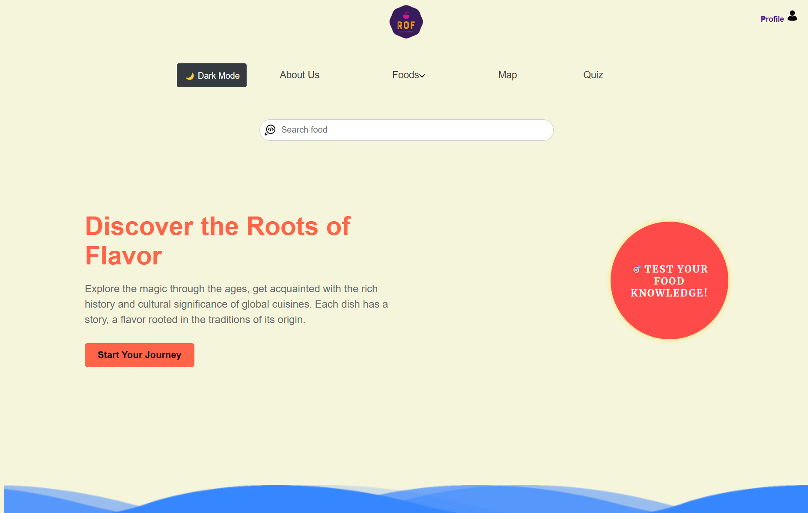

# Roots of Flavor
## Project Description

"Roots of Flavor" is a web application designed to help food enthusiasts discover, explore, and learn about a variety of foods from around the world. The platform allows users to search for food items by name and access detailed information, including descriptions, images, and the countries where the foods originate. The project aims to connect people with diverse cuisines, promoting cultural understanding and culinary exploration.

Target Audience:
This application is targeted at food enthusiasts, travelers, home cooks, or anyone looking to discover and learn about different foods from around the world.
### Team Members:
- Kantai Daulet
- Sanzhar Vaisov
- Nurdaulet Kolbai
  ## Screenshot
  

  ## How to Start the Project

Follow these steps to run the project on your local machine:

### 1. Clone the repository

Clone the project repository to your local machine:

```bash
git clone https://github.com/da3goo/Roots-of-Flavor.git
```
### 2. Set up the Backend (Go)
- Clone the repository.
- Navigate to the `Backend` directory.
- Install Go (version >= 1.18).
- Run `go mod tidy` to install dependencies.
- Set up your PostgreSQL database and configure the connection string in the `init` function or use existing online database
- Start the server by running:
  ```bash
  go run main.go


  ## Tools and Resources

1. **Go (Golang)**:
   - Programming language used to build the backend.
   - [Official Go website](https://golang.org/)

2. **PostgreSQL**:
   - Relational database used to store food information.
   - [Official PostgreSQL website](https://www.postgresql.org/)

3. **JavaScript**:
   - Programming language used to create the frontend interactivity.

4. **HTML/CSS**:
   - Markup and styling languages for building and designing the user interface.

5. **Postman**:
   - Tool for testing and documenting the API.
   - [Official Postman website](https://www.postman.com/)

6. **Supabase**:
   - Backend-as-a-Service platform providing database, authentication, and file storage services.
   - [Official Supabase website](https://supabase.com/)

7. **Visual Studio Code**:
   - Popular code editor supporting Go, JavaScript, HTML, CSS, and many extensions.
   - [Download Visual Studio Code](https://code.visualstudio.com/)

8. **Git and GitHub**:
   - Version control system for tracking changes in the project.
   - [Official Git website](https://git-scm.com/)
   - [GitHub](https://github.com/) for hosting and collaboration on the project.


